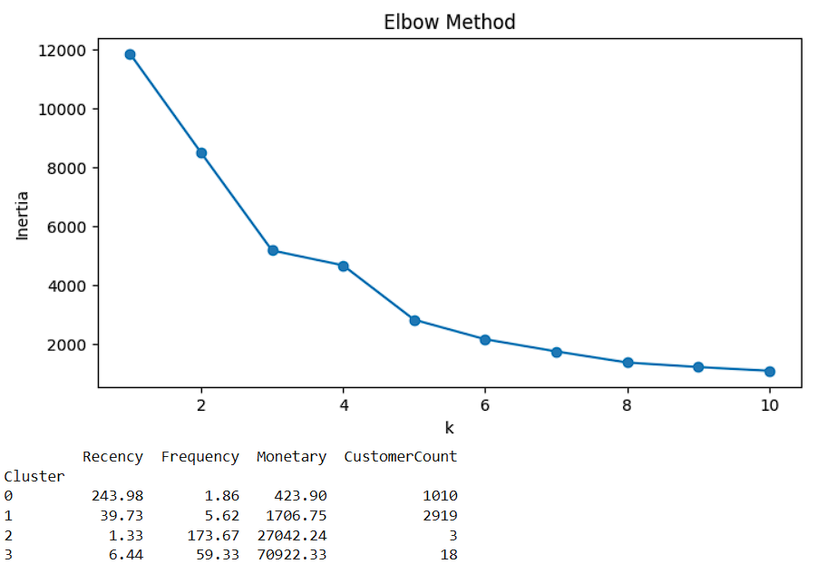

# Customer Segmentation for an E-commerce Platform

This project applies **RFM Analysis** and **K-Means Clustering** to segment customers of an e-commerce platform based on their purchasing behavior. The segmentation is visualized through a professional Power BI dashboard.

---

## Overview

Customer segmentation is crucial for personalized marketing, retention strategies, and business growth. Using historical transaction data, we identify groups of customers with similar behaviors based on:

- **Recency** – How recently a customer made a purchase
- **Frequency** – How often they purchase
- **Monetary** – How much they spend

---

## Key Objectives

- Clean and preprocess transaction data
- Derive RFM values per customer
- Apply **K-Means Clustering** to segment customers
- Visualize insights using **Power BI Dashboard**

---

## Dataset

**Source:** [Kaggle - Online Retail Dataset](https://www.kaggle.com/datasets/hellbuoy/online-retail-customer-clustering)

- Region: United Kingdom
- Period: Dec 2010
- Columns: `InvoiceNo`, `StockCode`, `Description`, `Quantity`, `InvoiceDate`, `UnitPrice`, `CustomerID`, `Country`

---

## ⚙️ Tools & Technologies

- **Python** (Pandas, NumPy, scikit-learn, matplotlib, seaborn)
- **Jupyter Notebook** – for analysis and modeling
- **Power BI** – for interactive dashboard creation

---

## 📘 Notebook Workflow: `Customer_seg.ipynb`

The Jupyter notebook contains the following major steps:

1. **Data Cleaning**

   - Remove nulls and duplicates
   - Filter transactions from the UK only

2. **Feature Engineering**

   - Calculate `TotalPrice` per transaction
   - Derive `Recency`, `Frequency`, and `Monetary` per customer

3. **RFM Analysis**

   - Use `datetime` to calculate recency
   - Aggregate data at `CustomerID` level

4. **K-Means Clustering**

   - Normalize RFM features
   - Use Elbow Method to choose optimal clusters
   - Assign `ClusterLabel` to each customer

5. **Export for Dashboard**
   - Save processed data with clusters for Power BI as CSV

---

## 🔍 Clustering Approach: Elbow Method & Cluster Summary

To identify the **optimal number of customer segments**, the **Elbow Method** was used. This technique helps determine the value of `k` (number of clusters) by plotting the **inertia (within-cluster sum of squares)** against increasing values of `k`.

- ### Elbow Method Result:



As seen in the graph, the **“elbow” point appears at `k = 4`**, suggesting that 4 clusters capture the optimal segmentation without overfitting.

---

- ### Cluster Summary Table:

| Cluster | Avg. Recency | Avg. Frequency | Avg. Monetary | Customer Count |
| ------- | ------------ | -------------- | ------------- | -------------- |
| 0       | 243.98       | 1.86           | 423.90        | 1010           |
| 1       | 39.73        | 5.62           | 1706.75       | 2919           |
| 2       | 1.33         | 173.67         | 27042.24      | 3              |
| 3       | 6.44         | 59.33          | 70922.33      | 18             |

- **Cluster 0**: Inactive or churned customers with high recency and low spend
- **Cluster 1**: Majority group with moderate engagement and spending
- **Cluster 2**: Outliers with extremely high purchase frequency and value
- **Cluster 3**: VIP customers – very recent, frequent, and high-spending

These clusters were later used in Power BI for visualization and deeper segmentation insights.

---

## 📊 Dashboard Snapshot


---

## 📊 Power BI Dashboard Highlights

**File:** `dashboard/customer_dashboard.pbix`  
**Screenshots:** `dashboard/`

### 🔹 Key Visuals:

- 📍 **Scatter Plot (RFM Clusters)**

  - X: Frequency, Y: Monetary, Legend: ClusterLabel

- 🧱 **Treemap**

  - Grouped by ClusterLabel, sized by TotalSpend, showing count of customers

- 📅 **Card KPIs**

  - Number of unique customers, top cluster, total revenue

- 📈 **Bar Charts**
  - Cluster-wise Average RFM Metrics

### 🖌️ Used Color Scheme

| Cluster | Color Suggestion | Purpose             |
| ------- | ---------------- | ------------------- |
| 0       | Blue             | Low-Value Customers |
| 1       | Green            | Loyal/High Spenders |
| 2       | Red              | Potential/Medium    |
| 3       | Orange           | Others or Outliers  |

---

## 🚀 How to Run

1. Clone the repository:

```bash
git clone https://github.com/Aditi-1304/Customer-Segmentation-RFM-KMeans.git
```

2. Set up Python environment:

```bash
pip install -r requirements.txt
```

3. Open and run `Customer_seg.ipynb` using Jupyter or VS Code

4. Open `dashboard/customer_dashboard.pbix` in Power BI Desktop

---

## 📬 Results & Insights

- Distinct customer segments based on behavior
- Identified high-value and at-risk customers
- Visualized trends in customer spend and frequency
- Actionable insights for targeted marketing

---

## 🙋‍♀️ Author

- Aditi Agrawal
- Portfolio: https://aditi-1304.github.io/index.html
- GitHub: https://github.com/Aditi-1304
